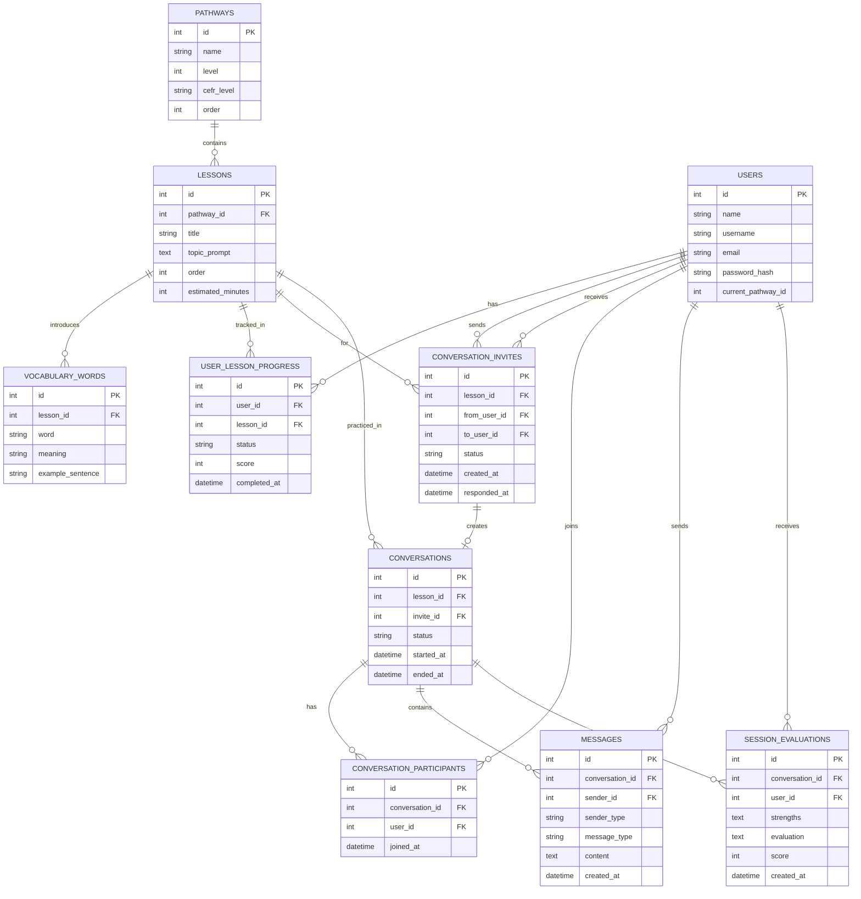

# Anna-101 — Database ERD

## Catatan desain

- **`sender_type`** di `MESSAGES` bernilai `user` atau `ai`. Kalau `ai`, kolom `sender_id` bernilai `null`.
- **`message_type`** membedakan pesan: `chat` (percakapan normal antar user), `suggestion` (saran jawaban dari AI saat diminta), `system` (notifikasi seperti "Anna finish").
- **Demo percakapan pembuka** (contoh greeting yang digenerate AI di awal sesi) **tidak disimpan** ke tabel `MESSAGES` — sifatnya ephemeral, cukup dikirim ke frontend lewat socket.io dan dibuang setelah user membalas "Anna ready".
- **`CONVERSATION_INVITES`** punya dua relasi ke `USERS` (`from_user_id` dan `to_user_id`) — satu user mengundang user lain lewat username untuk berlatih bareng di satu `lesson`.
- **`SESSION_EVALUATIONS`** dibuat satu baris per partisipan per sesi, karena evaluasi AI di akhir sesi bisa beda untuk tiap user meski dalam room yang sama.
